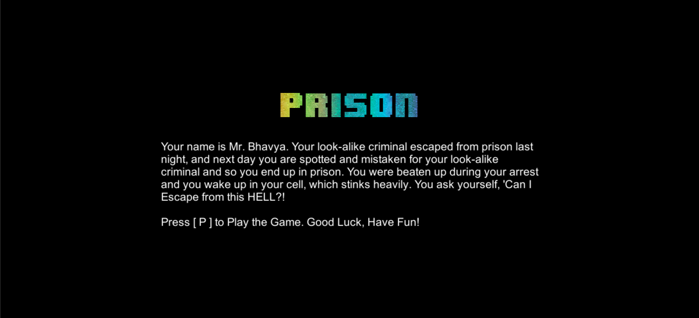
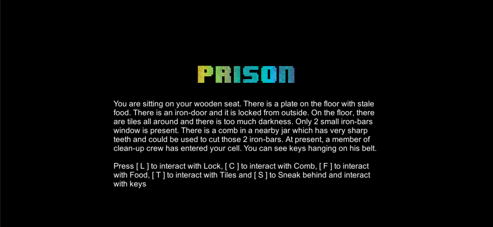
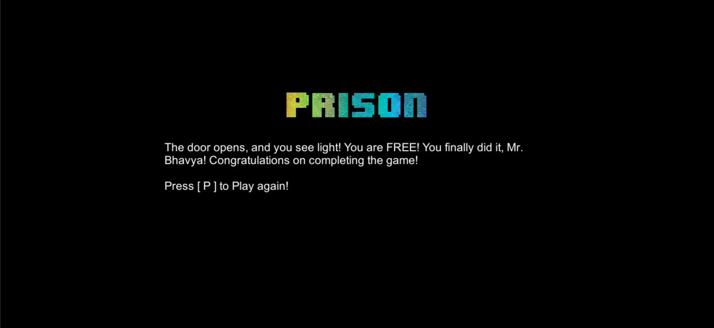

# Unity: PrisonEscape Text101 (Text-Based Adventure Game)

 

This is my second game project with Unity. This time it is a text-based adventure game.
<ul>
<li>It is first UI game</li>
<li>Here, some scenario is written on screen</li>
<li>At last, there are some options with Keys so that player can choose path</li>
<li>If chosen right path, player can escape the prison</li>
</ul>

# Plot
Your name is Mr. Bhavya. Your look-alike criminal escaped from prison last night, and next day you are spotted and mistaken for your look-alike criminal and so you end up in prison. You were beaten up during your arrest and you wake up in your cell, which stinks heavily. You ask yourself, 'Can I Escape from this HELL?!'

# Screenshots

<h2>Start Screen</h2>

<h2>First Scenario</h2>

<h2>Win Screen</h2>

